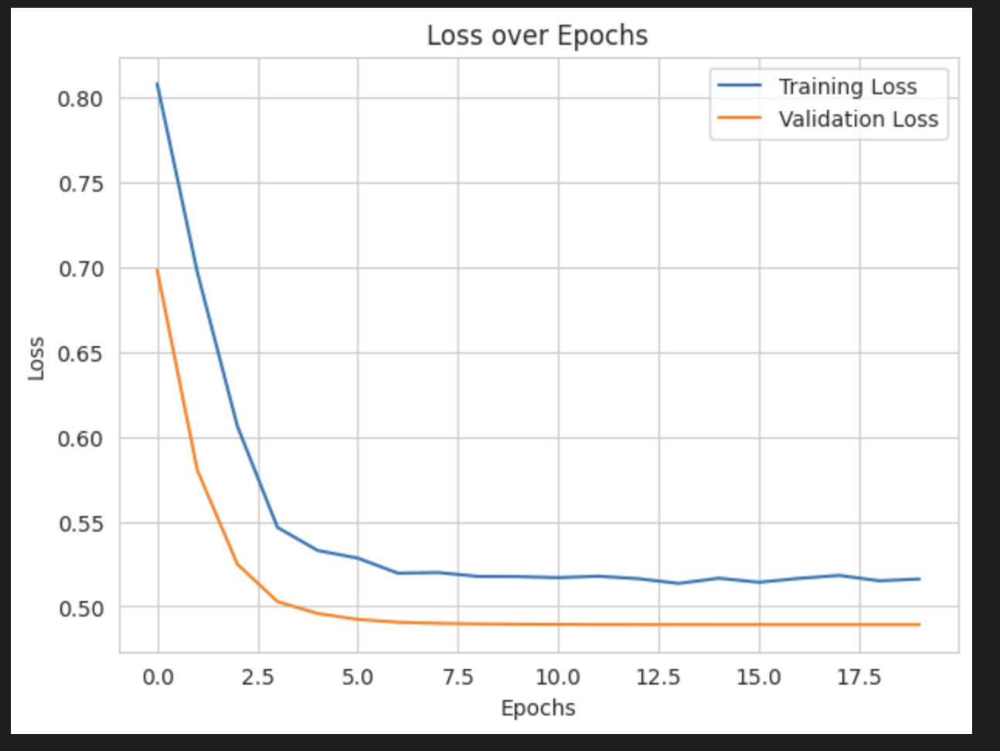

# Transformer from Scratch for Text Classification

This project details the implementation of a Transformer model from scratch using PyTorch for multi-class text classification. The model is trained and evaluated on the DBpedia dataset, with a focus on exploring data preprocessing, hyperparameter tuning, and performance optimization to achieve high accuracy. The final model successfully achieves a test accuracy of over 80%.

---

## 📊 Dataset Overview

The project utilizes the **DBpedia dataset**, which contains 14 classes representing different topics from Wikipedia (e.g., Company, Artist, Athlete). An exploratory data analysis (EDA) was performed to understand the dataset's characteristics.

* **Class Distribution**: The dataset is well-balanced, which is ideal for training a classification model without a strong bias towards any particular class.
    

* **Text Length Distribution**: A histogram of the text length shows that most articles are relatively short, with a long tail of longer articles. This analysis informed the decision for padding and truncating sequences to a uniform length for model training.
    

---

## 🧠 Model Architecture: Transformer

A **Transformer Encoder** model was implemented from scratch for the classification task. The Transformer architecture relies on **self-attention mechanisms** to weigh the importance of different words in the input sequence, allowing it to capture complex contextual relationships.

* **Core Components**:
    * **Embedding Layer**: Converts input tokens into dense numerical vectors.
    * **Positional Encoding**: Adds information about the position of each token in the sequence, which is crucial since the model itself does not process data sequentially.
    * **Transformer Encoder**: Consists of multiple `TransformerEncoderLayer` instances, each containing a multi-head self-attention mechanism and a feed-forward network.
    * **Output Layer**: A final `Linear` layer maps the aggregated output from the Transformer to the 14 class probabilities.

**Model Summary (`torchinfo`)**

---

## ⚙️ Training & Optimization

The model was trained using a comprehensive strategy that included:
* **Text Preprocessing**: The text was cleaned by removing punctuation and stop words, tokenized, and converted into numerical sequences using a custom vocabulary.
* **Hyperparameter Tuning**: Key hyperparameters such as learning rate, batch size, and dropout rate were tuned to optimize performance on the validation set.
* **Optimization**: The **Adam optimizer** was used, along with a `ReduceLROnPlateau` learning rate scheduler, which reduces the learning rate when the validation loss plateaus.

---

## 🏆 Performance & Evaluation

The final model was evaluated on the held-out test set to assess its performance.

**Training & Validation Curves**
The learning curves show stable convergence, with the validation loss closely tracking the training loss, indicating a well-regularized model without significant overfitting.

**Quantitative Results**
The final model achieved a **test accuracy of 83.5%**. A detailed breakdown of the performance is provided by the classification report and ROC curves.

* **Classification Report**: The report shows strong precision, recall, and F1-scores across most of the 14 classes, with a macro average F1-score of 0.83.
    

* **ROC Curve**: The Receiver Operating Characteristic (ROC) curve for each class demonstrates the model's excellent ability to distinguish between classes, with high Area Under the Curve (AUC) scores for all categories.
    

---

## 🚀 How to Run

1.  **Prerequisites**: Ensure you have Python and the necessary libraries installed from `requirements.txt`.
2.  **Dataset**: Place the `Tweets.csv` file in the same directory as the project scripts.
3.  **Execution**: Run the `train.py` script to execute the full pipeline, from data loading to model training and final evaluation.## Final Results
## Final Results and Conclusion
